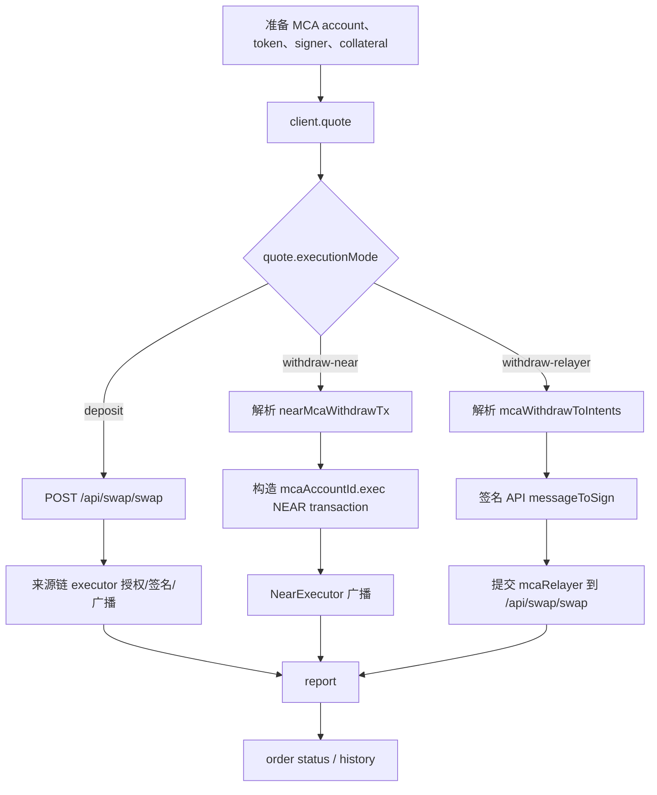

# MCA Swap API 使用文档

本文说明如何使用 `@rhea-finance/cross-chain-aggregation-dex` 完成 Swap 场景中的 MCA deposit 和 withdraw。

实现逻辑参考 `multi-chain-lending` 的统一 Swap 调用流程，包括：

- MCA deposit 与 `useAsCollateral`。
- MCA withdraw 的 collateral decrease 和 `withdrawAll`。
- withdraw 到 MCA 绑定 NEAR 钱包的合约直执行。
- withdraw 到其他链的 Intents / multichain relayer。
- MCA 绑定钱包选择、消息签名、report、order status 和 history。

本文不包含 MCA 创建、钱包绑定、借贷账户查询、portfolio 查询或清算逻辑。

## 1. 安装与初始化

```bash
pnpm add @rhea-finance/cross-chain-aggregation-dex
```

```ts
import { SwapClient } from "@rhea-finance/cross-chain-aggregation-dex";

const client = new SwapClient({
  baseUrl: "https://api.rhea.finance",
  getAccessToken: async () => sessionStorage.getItem("access-token") ?? "",
  reportMode: "auto",
  executors: [
    evmExecutor,
    solanaExecutor,
    nearExecutor,
    bitcoinExecutor,
    zcashExecutor,
    aptosExecutor,
    suiExecutor,
    tronExecutor,
  ],
  onEvent(event) {
    console.log(event.type, event);
  },
});
```

MCA 是统一 Swap API 的内部执行分支，不再使用单独的 MCA 命名空间。所有业务都通过根方法调用：

```ts
client.quote(...);
client.buildSwap(...);
client.swap(...);
client.report(...);
client.getHistory(...);
```

SDK 不包含固定 API token，也不接收私钥或助记词。钱包签名和链上广播由应用注入的 adapter 完成。

## 2. 完整调用流程



推荐调用方式：

```ts
const quote = await client.quote(request);

switch (quote.executionMode) {
  case "deposit":
  case "withdraw-near":
  case "withdraw-relayer":
    return client.swap({
      quote,
      waitFor: "completed",
    });
}
```

应用不需要自行解析 `nearMcaWithdrawTx` 或 `mcaWithdrawToIntents`。SDK 会根据目标是否为绑定 NEAR account 得出的 `executionMode` 选择流程，不把 preview 中的 `submissionMode` 当作分支开关。

## 3. 公共约定

### 3.1 金额

- `amountIn`、quote 输出和普通 token amount 使用最小单位十进制字符串。
- `slippageBps` 使用 basis points，例如 `50` 表示 0.5%。
- `decreaseAmountBurrow` 使用 portfolio 中的 Burrow decimal balance string，可以包含小数点；它不是 token 最小单位。
- 不要传 JavaScript 浮点数。

```ts
import { parseUnits } from "@rhea-finance/cross-chain-aggregation-dex";

const amountIn = parseUnits("1.5", 6); // "1500000"
```

### 3.2 MCA token address

MCA 侧 token 的 `AssetRef.address` 必须使用 Swap API/Burrow 识别的 token id，而不是 UI 中的 `mca:` asset key。

```ts
const mcaUsdc = {
  chain: "near" as const,
  address: "usdc.token.near",
  symbol: "USDC",
  decimals: 6,
};
```

### 3.3 Signer

quote 请求只需包含 `signerChain`。SDK 会从该链已注册的 executor adapter 调用 `getIdentityKey()`，并把解析出的 `chain` 和 `identityKey` 发送给 quote API。relayer withdraw 会继续调用同一个 adapter 的 `signMessage()`：

```ts
import {
  createEvmExecutor,
  type EvmWalletAdapter,
} from "@rhea-finance/cross-chain-aggregation-dex/executors/evm";

const adapter: EvmWalletAdapter = {
  getIdentityKey: () => wallet.address,
  async signMessage(message, options) {
    if (options?.signal?.aborted) throw options.signal.reason;
    const signature = await wallet.signMessage(message);
    return signature.replace(/^0x/i, "");
  },
  sendTransaction,
  signTypedData,
};

const evmExecutor = createEvmExecutor(adapter);
```

应用不再创建或传入 signer object。`getIdentityKey()` 是 MCA quote 必需能力；只有 relayer withdraw 需要 `signMessage()`。普通 swap 和链上交易执行不会额外调用这两个方法。

## 4. MCA Deposit

Deposit 的资金来自普通链上钱包，目标是 MCA 中的 token。

### 4.1 请求 quote

```ts
import type {
  McaDepositQuoteRequest,
} from "@rhea-finance/cross-chain-aggregation-dex";

const request: McaDepositQuoteRequest = {
  flow: "deposit",
  mcaAccountId: "account.near",

  fromChain: "1",
  toChain: "near",
  tokenIn: {
    chain: "1",
    address: "0xA0b86991c6218b36c1d19d4a2e9eb0ce3606eb48",
    symbol: "USDC",
    decimals: 6,
  },
  tokenOut: {
    chain: "near",
    address: "usdc.token.near",
    symbol: "USDC",
    decimals: 6,
  },

  amountIn: "1000000",
  slippageBps: 50,
  sender: "0xSenderAddress",
  recipient: "account.near",

  signerChain: "evm",
  collateral: {
    useAsCollateral: true,
  },
};

const quote = await client.quote(request);

if (quote.executionMode !== "deposit") {
  throw new Error(`Unexpected MCA mode: ${quote.executionMode}`);
}
```

发送到 `POST /api/swap/quote` 的 MCA 字段：

```json
{
  "mca": {
    "flow": "deposit",
    "mcaAccountId": "account.near",
    "signer": {
      "chain": "evm",
      "identityKey": "0xSenderAddress"
    },
    "useAsCollateral": true
  }
}
```

### 4.2 Build 与执行

直接执行：

```ts
const result = await client.swap({
  quote,
  waitFor: "completed",
});
```

分开 build 和 execute：

```ts
const build = await client.buildSwap({ quote });

inspectTransaction(build.execution);

const result = await client.executeSwap({
  build,
  waitFor: "completed",
});
```

流程行为：

1. `client.buildSwap()` 调用 `POST /api/swap/swap`。
2. SDK 根据 build response 选择已注册的来源链 executor。
3. executor 完成 approve、签名和广播。
4. report 自动增加 `multi_addr: mcaAccountId`。
5. `tx_type` 保持统一 Swap API 的 `same-chain` 或 `cross-chain`。

## 5. MCA Withdraw Collateral

SDK 不查询 lending portfolio。应用需要传入 collateral 决策，或者使用 helper 从已有数据计算。

### 5.1 直接传入

```ts
const collateral = {
  needDecrease: true,
  decreaseAmountBurrow: "12.5",
  withdrawAll: false,
};
```

对应 API 字段：

```json
{
  "needDecreaseCollateral": true,
  "decreaseCollateralAmountBurrow": "12.5",
  "withdrawAll": false
}
```

### 5.2 使用计算 helper

```ts
import {
  resolveMcaWithdrawPolicy,
} from "@rhea-finance/cross-chain-aggregation-dex";

const collateral = resolveMcaWithdrawPolicy({
  collateralBalance: "12.5",
  availableBalance: "20",
  amountIn: "19.99998",
  isMax: false,
});

// {
//   needDecrease: true,
//   decreaseAmountBurrow: "12.5",
//   withdrawAll: true
// }
```

`withdrawAll` 在以下情况为 true：

- UI 选择 max。
- `amountIn` 等于 available balance。
- `amountIn / availableBalance >= 0.999999`。

计算使用 decimal string 和 `BigInt`，不会产生浮点误差。

`resolveMcaWithdrawPolicy()` 的三个 balance/amount 参数必须使用同一 human-decimal 口径。它返回的 `decreaseAmountBurrow` 是完整 collateral balance；真正发送 quote 的 `request.amountIn` 仍需单独转换成 token 最小单位整数。

## 6. Withdraw 到绑定 NEAR 钱包

当目标是 MCA 绑定的 NEAR account 时，可以直接调用 MCA 合约执行 withdraw。

### 6.1 注册 NearExecutor

```ts
import {
  createNearExecutor,
} from "@rhea-finance/cross-chain-aggregation-dex/executors/near";

const nearExecutor = createNearExecutor({
  getIdentityKey: () => nearWallet.accountId,
  getChain: () => "near",
  async signAndSendTransactions(transactions) {
    const results = await nearWallet.signAndSendTransactions({ transactions });
    return {
      txHashes: results.map((item) => item.transaction.hash),
      raw: results,
    };
  },
});
```

具体 wallet SDK 的 transaction/action 转换由 adapter 负责。

### 6.2 Quote

```ts
import type {
  McaWithdrawQuoteRequest,
} from "@rhea-finance/cross-chain-aggregation-dex";

const request: McaWithdrawQuoteRequest = {
  flow: "withdraw",
  mcaAccountId: "account.near",

  fromChain: "near",
  toChain: "near",
  tokenIn: mcaUsdc,
  tokenOut: nearUsdc,

  amountIn: "1000000",
  slippageBps: 50,
  sender: "account.near",
  recipient: "alice.near",

  signerChain: "near",
  collateral,

  executionPreference: "near",
  boundNearAccountId: "alice.near",
};

const quote = await client.quote(request);

if (quote.executionMode !== "withdraw-near") {
  throw new Error(`Unexpected MCA mode: ${quote.executionMode}`);
}
```

也可以使用 `executionPreference: "auto"`。auto 仅在以下条件全部满足时选择 `withdraw-near`：

- `toChain === "near"`。
- `recipient` 非空。
- `recipient === boundNearAccountId`。

否则 auto 选择 `withdraw-relayer`。

`executionPreference: "near"` 和 `"relayer"` 是强制覆盖值。SDK 不会在强制 `near` 时再次验证 `recipient` 是否属于 `boundNearAccountId`，因此普通应用应优先使用 `auto`；只有调用方已经独立验证绑定关系时才强制选择 `near`。

### 6.3 执行

```ts
const result = await client.swap({
  quote,
  waitFor: "completed",
});
```

SDK 会：

1. preview 优先使用 `nearMcaWithdrawTx`；目标为绑定 NEAR 且该字段缺失时，回退到 `mcaWithdrawToIntents`。
2. 从选中的 preview 以下位置解析 `business`：
   - 顶层 `business`。
   - `transactions[0].args.business`。
   - `actions[].params.args.business`，支持 object 和 JSON string。
3. 按相同位置和优先级解析 `signer_wallet`；缺失时使用 `{ Near: recipient }`。
4. preview 有有效 `transactions[]` 时逐项映射，并保留已有 args 后覆盖 `business`、`signer_wallet`、空 `signature`；只有 `actions[]` 时用它提取参数，再构造一笔 `mcaAccountId.exec`。
5. 将 preview 中的 TGas 转为 gas unit，将 NEAR deposit 转为 yoctoNEAR。
6. 使用 NearExecutor 请求钱包签名并广播。
7. report 使用：
   - `tx_type: "mca-withdraw-near"`
   - `multi_addr: mcaAccountId`
8. `waitFor: "completed"` 时使用 preview deposit address + router 查询 order status；缺少 deposit address 会在广播前失败。

该路径与参考应用一致，不额外调用 MCA `signMessage`；NEAR 钱包对合约交易本身进行授权。

## 7. Withdraw 到其他链：Intents Relayer

目标为 EVM、Solana、Bitcoin、Aptos、Sui、Zcash、Tron 等非绑定 NEAR 地址时，使用 relayer 流程。

### 7.1 准备 executor 的消息签名方法

```ts
const evmAdapter = {
  getIdentityKey: () => evmWallet.address,
  async signMessage(message: string, options) {
    if (options?.signal?.aborted) throw options.signal.reason;
    const signature = await evmWallet.signMessage(message);
    return signature.replace(/^0x/i, "");
  },
  sendTransaction,
  signTypedData,
};

const evmExecutor = createEvmExecutor(evmAdapter);
```

### 7.2 Quote

```ts
const quote = await client.quote({
  flow: "withdraw",
  mcaAccountId: "account.near",

  fromChain: "near",
  toChain: "1",
  tokenIn: mcaUsdc,
  tokenOut: ethereumUsdc,

  amountIn: "1000000",
  slippageBps: 50,
  sender: "account.near",
  recipient: evmWallet.address,

  signerChain: "evm",
  collateral,
  executionPreference: "relayer",
});

if (quote.executionMode !== "withdraw-relayer") {
  throw new Error(`Unexpected MCA mode: ${quote.executionMode}`);
}
```

### 7.3 签名、提交与状态查询

```ts
const result = await client.swap({
  quote,
  waitFor: "completed",
  async beforeSign(preview) {
    // 应用可以在此向用户展示 chain、identity、message 和 business。
    await showMcaSignConfirmation(preview);
  },
});
```

SDK 读取 API 返回的 `mcaWithdrawToIntents.messageToSign`，校验其非空后交给对应 executor adapter 的 `signMessage()`，不会用客户端重新 `JSON.stringify(business)` 代替该 message。当前实现会先去掉 message 首尾空白；服务端不应把首尾空白作为签名内容的一部分。直接调用 HTTP API 时仍应把该字段视为 opaque string，按 HTTP 文档签原始 UTF-8 内容。

签名后提交到 `POST /api/swap/swap` 的关键字段：

```json
{
  "mcaRelayer": {
    "mcaAccountId": "account.near",
    "wallet": {
      "EVM": "SenderAddressWithout0x"
    },
    "business": {
      "action": "withdraw"
    },
    "signature": "wallet-signature"
  },
  "mca": {
    "flow": "withdraw",
    "mcaAccountId": "account.near"
  },
  "deposit_address": "intents-deposit-address",
  "is_cross_chain": true,
  "tx_type": "mca-withdraw-relayer",
  "multi_addr": "account.near"
}
```

流程行为：

1. 再次读取 executor identity，并校验它与 quote 时解析出的 signer identity 一致。
2. 解析 `business`、`messageToSign` 和 deposit address；`messageToSign` 会做非空/首尾空白归一化，deposit address 按 quote 顶层、preview、`bestQuote` 顺序读取，并兼容 direct/nested camelCase/snake_case 字段。
3. 调用 `beforeSign`。
4. 调用 executor adapter 的 `signMessage(messageToSign, options)`。
5. 提交 `mcaRelayer` build body。
6. 从 build response `orderId` 或 `deposit.orderId` 解析 orderId；router 使用 build `router`，缺失时回退 quote router。
7. report 使用 orderId 作为 `from_hash`。
8. 通过 orderId + router 轮询状态。

该路径使用 signer chain executor 暴露的消息签名能力，但不调用其交易 `execute()`，也不广播一笔假的来源链交易。

## 8. 多链 signer 选择

参考 `multi-chain-lending` 的绑定钱包选择逻辑，SDK 提供纯函数选择当前已连接且属于 MCA 的 signer。

```ts
import {
  selectMcaSigner,
  type McaSignerIdentity,
} from "@rhea-finance/cross-chain-aggregation-dex";

const boundWallets = [
  { EVM: "abc123" },
  { Solana: "solana-public-key" },
];

const connectedSigners: McaSignerIdentity[] = [
  { chain: "evm", identityKey: evmWallet.address },
  { chain: "solana", identityKey: solanaWallet.publicKey.toBase58() },
];

const signer = selectMcaSigner(boundWallets, connectedSigners);

if (!signer) {
  throw new Error("Connect a wallet that is bound to this MCA");
}
```

本文覆盖的链 signer 在默认选择器中的相对优先级：

1. EVM
2. Solana
3. Bitcoin
4. Aptos
5. NEAR
6. Zcash
7. Sui
8. Tron

可以传入自定义优先级：

```ts
const signer = selectMcaSigner(
  boundWallets,
  connectedSigners,
  ["near", "evm", "solana"]
);
```

### 8.1 Wallet 格式映射

```ts
import {
  formatMcaWallet,
} from "@rhea-finance/cross-chain-aggregation-dex";

formatMcaWallet("evm", "0xAbC");
// { EVM: "AbC" }
```

| 链 signer | API wallet 字段 | identity 说明 |
| --- | --- | --- |
| `evm` | `EVM` | 地址去掉 `0x` 前缀 |
| `solana` | `Solana` | Solana public key |
| `btc` | `Bitcoin` | Bitcoin signing public key |
| `near` | `Near` | NEAR account id |
| `aptos` | `Aptos` | Aptos public key/identity |
| `sui` | `Sui` | Sui public key；也可用 adapter `accountId` 匹配绑定地址 |
| `zcash` | `Zcash` | Zcash lending signing public key |
| `tron` | `Tron` | Tron identity/address，由应用提供 signMessage 能力 |

EVM、Aptos 和 Sui 的十六进制 identity 比较不区分大小写；Solana、Bitcoin、NEAR 等 identity 使用精确匹配。

## 9. Quote 高级字段

当 API 需要额外证明签名时，可以在 quote 请求中传入：

```ts
const quote = await client.quote({
  ...request,
  recipientMsgSignatures: ["recipient-signature"],
  depositSignerProofSignatures: ["deposit-signer-proof"],
});
```

对应 MCA payload：

```json
{
  "recipientMsgSignatures": ["recipient-signature"],
  "depositSignerProofSignatures": ["deposit-signer-proof"]
}
```

## 10. 方法参考

### `client.quote(request, options?)`

```ts
quote(
  request: McaQuoteRequest,
  options?: { signal?: AbortSignal }
): Promise<McaQuote>
```

返回判别联合：

```ts
type McaQuote =
  | McaDepositQuote
  | McaWithdrawNearQuote
  | McaWithdrawRelayerQuote;
```

会校验：

- MCA account 和 executor 返回的 signer identity 非空。
- collateral decimal 格式。
- router 必须与 flow 匹配。
- `nearDepositTxError` / `nearMcaWithdrawTxError`。
- 对应 execution mode 所需的 preview 存在。

### `client.buildSwap(input)`

```ts
buildSwap({
  quote,
  signal,
}): Promise<SwapBuild>
```

支持：

- `deposit`：请求 API build。
- `withdraw-near`：根据 quote preview 本地准备 NEAR build。

不支持单独 build `withdraw-relayer`，因为 relayer build 必须包含用户签名。该模式使用 `client.swap()`。

`buildSwap()` 不调用钱包；钱包交互由后续 `client.executeSwap()` 触发。

### `client.swap(input)`

```ts
swap({
  quote,
  waitFor,
  signal,
  beforeSign,
  onEvent,
}): Promise<SwapExecutionResult>
```

`waitFor`：

- `submitted`：提交后返回。
- `source-confirmed`：在 executor 支持确认时等待来源交易确认。
- `completed`：有 order/status reference 时等待终态。

### `client.report(result)`

`reportMode: "manual"` 时手动上报：

```ts
const result = await client.swap({ quote });
await client.report(result);
```

`reportMode` 行为：

| 模式 | 行为 |
| --- | --- |
| `auto` | 提交后自动 report；report 失败只返回 warning，不否定已提交交易 |
| `manual` | 保存 report context，由应用调用 `client.report(result)` |
| `disabled` | 不自动 report |

### `client.getHistory(request, options?)`

```ts
const page = await client.getHistory({
  sender: "account.near",
  page: 1,
  pageSize: 20,
  status: ["pending", "processing", "completed"],
});
```

查询 MCA history 时，将 `mcaAccountId` 作为统一 history API 的 `sender` 参数传入。后端会用这个值匹配记录的 `sender`、`recipient` 或 `multi_addr`，因此一次查询可以覆盖 MCA Deposit 和 Withdraw。

注意：

- SDK 不再按 `raw.multi_addr === mcaAccountId` 二次过滤，直接保留服务端分页结果和统计值。
- API 可能把返回记录中的 MCA 地址展示为 `Cross-chain Account`，调用方不能依赖返回字段与原始 MCA account id 精确相等。
- 如果同时传入 `status`，通用 history 层仍只在当前服务端返回页内过滤状态，此时 `filteredLocally` 才会为 true，服务端分页统计保持不变。

## 11. Lifecycle 事件

```ts
const result = await client.swap({
  quote,
  waitFor: "completed",
  onEvent(event) {
    switch (event.type) {
      case "build-started":
      case "build-completed":
      case "approval-requested":
      case "approval-submitted":
      case "signing-requested":
      case "submitted":
      case "source-confirmed":
      case "order-status":
      case "completed":
      case "requires-user-action":
      case "warning":
      case "failed":
        updateTransactionUi(event);
        break;
    }
  },
});
```

典型 relayer 事件顺序：

```text
signing-requested
submitted
order-status
completed
```

report 失败时会增加 `warning`，但已经提交的 relayer order 或链上交易仍然有效。

## 12. 错误处理

```ts
import {
  SwapSdkError,
} from "@rhea-finance/cross-chain-aggregation-dex";

try {
  await client.swap({ quote, waitFor: "completed" });
} catch (error) {
  if (!(error instanceof SwapSdkError)) throw error;

  switch (error.code) {
    case "QUOTE_EXPIRED":
      // 重新请求 quote；SDK 会在签名或广播前检查。
      break;
    case "SIGNING_FAILED":
    case "USER_REJECTED":
      // 保持用户资金不变，允许重新签名。
      break;
    case "INVALID_API_RESPONSE":
      // quote preview、deposit address、orderId 等字段缺失。
      break;
    case "ORDER_TIMEOUT":
      // 交易可能仍在处理中，查询 history 或稍后继续查询状态。
      break;
  }
}
```

关键安全规则：

- quote 过期后不会请求钱包签名或广播。
- relayer signer 必须与 quote signer 一致。
- 只签 API 返回的 `messageToSign`。
- NEAR `waitFor: "completed"` 缺少 status deposit address 时会在广播前失败。
- report 失败不等于 swap 失败。
- SDK 日志不会输出签名、business、message、交易序列化内容或 access token。

## 13. 与 `multi-chain-lending` 调用逻辑的对应关系

| `multi-chain-lending` 逻辑 | SDK API |
| --- | --- |
| `buildNearSameChainMcaQuoteBody` | `client.quote()` / `serializeMcaQuoteRequest()` |
| `computeMcaDecreaseCollateralForQuote` | `resolveMcaWithdrawPolicy()` 或显式 collateral |
| `computeMcaWithdrawAllForQuote` | `resolveMcaWithdrawPolicy()` |
| `getSingerWalletsData` | `selectMcaSigner()` |
| `format_wallet` | `formatMcaWallet()` |
| `nearMcaWithdrawTx` business 解析 | `extractMcaWithdrawBusiness()` |
| `buildCallOnNearTransactionsFromMcaWithdrawPreview` | `buildNearMcaWithdrawTransactions()` |
| `buildMcaWithdrawRelayerSwapRequest` | `buildMcaWithdrawRelayerRequest()` |
| `call_on_near` | 注入 `NearExecutor` 后调用 `client.swap()` |
| `sign_message` | 在对应 executor adapter 中实现 `signMessage()` |
| `postSwapReport` | `reportMode: "auto"` 或 `client.report()` |
| `pollCrossChainOrderStatus` | `waitFor: "completed"` / `client.waitForOrder()` |

应用层无需迁移 React hooks、Zustand store、Toast、Modal 或浏览器全局钱包访问。只需要把已连接的钱包能力封装成 executor adapter。

## 14. Raw API 调试

需要排查后端字段时，可以使用 raw surface：

```ts
const rawQuote = await client.quoteRaw({
  fromChain: "near",
  toChain: "1",
  tokenIn: "usdc.token.near",
  tokenOut: "0xusdc",
  amountIn: "1000000",
  slippage: 50,
  sender: "account.near",
  recipient: "0xRecipient",
  mca: {
    flow: "withdraw",
    mcaAccountId: "account.near",
    signer: {
      chain: "evm",
      identityKey: "0xSigner",
    },
    needDecreaseCollateral: false,
    decreaseCollateralAmountBurrow: "0",
  },
});
```

生产业务优先使用 `client.quote()` 和 `client.swap()`；raw API 不负责 MCA mode 判定、preview 校验、签名一致性、report context 或状态编排。
