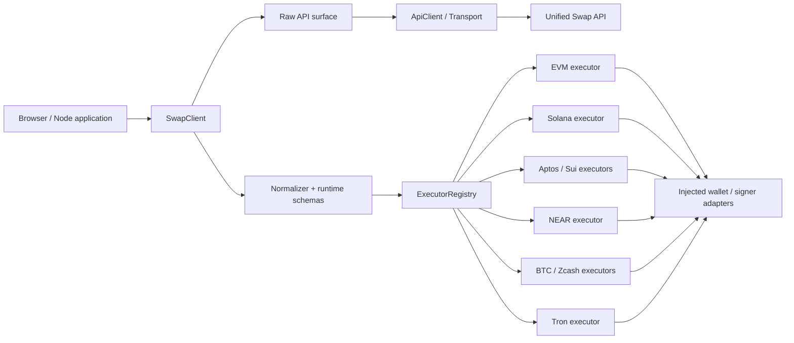
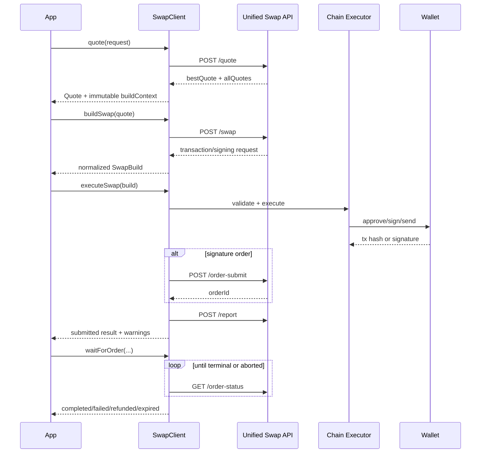

# Multi-chain Swap SDK 设计

- 日期：2026-07-21
- 状态：已确认，等待实现计划
- 目标仓库：`crossChain-aggregation-sdk`
- 参考实现：`multi-chain-lending` 中统一 Swap API、交易构建、各链执行与 History 逻辑

## 1. 背景

现有实现已经接入统一 Swap API，并支持 EVM、Solana、Aptos、NEAR、Tron、Bitcoin、Zcash 和 Sui。但是 HTTP 调用、API 字段兼容、交易类型判断、钱包签名、状态轮询与页面状态混合在应用代码中，导致：

- 调用方需要手动复制 `router`、`market`、`expectedOut`、`preSwap`、`bridge` 和 `quoteId`。
- 交易类型依赖字段形状或 UI 当前钱包状态推断，新增链容易影响已有链。
- 浏览器全局变量与具体钱包库阻止核心能力在 Node.js 使用。
- API 原始格式包含多种字段别名和 `Record<string, unknown>`，业务调用缺乏稳定、可判别的类型。
- approve、签名、广播、上报与跨链轮询缺少统一生命周期和错误语义。
- API 凭证不应固化在前端模块或 SDK 包中。

本设计将这些能力收敛为一个浏览器和 Node.js 均可使用的 TypeScript SDK。

## 2. 目标与非目标

### 2.1 目标

SDK 首期提供以下能力：

1. 统一 quote、build swap、execute swap、order submit、order status、report 和 history。
2. 同时提供原始 API 接口与标准化接口。
3. API 负责返回 quote 和待签名交易或转账描述；SDK 不实现路由算法。
4. 标准接口使用严格的判别联合类型覆盖：
   - EVM
   - Solana
   - Aptos
   - NEAR
   - Tron
   - Bitcoin
   - Zcash
   - Sui
5. 通过 Chain Executor Adapter 完成可选的授权、签名、广播与确认。
6. 核心 HTTP、quote、build、status 和 history 能力同时支持浏览器与 Node.js。
7. 新增链时不修改 `SwapClient`，只注册新的 normalizer 和 executor。
8. 保持与 `multi-chain-lending` 当前统一 Swap API 的请求、响应和交易格式兼容。

### 2.2 非目标

首期不包含：

- 在客户端实现 DEX 聚合、跨链路由或价格发现算法。
- 在核心包中维护钱包连接 UI、React hooks、Toast、Modal 或全局 Store。
- 在核心 SDK 中维护 token 图标、价格、区块浏览器 URL 或应用展示名称。
- 托管私钥、助记词或固定 API 凭证。
- 自动猜测 token decimals 或把人类可读金额隐式转换为最小单位。
- 将 Lending/MCA 业务编排固化进通用 Swap 核心；相关字段通过扩展与 raw 接口保持兼容。

## 3. 已确认的设计决策

1. 使用 **Core + Chain Adapters** 架构。
2. 单 npm 包发布，通过子路径导出按需加载 executor。
3. API 返回 quote 和各链待签名交易；SDK 负责标准化、校验和可选执行。
4. 同时支持：
   - `buildSwap()`：只构建，不触发钱包。
   - `executeSwap()`：消费已构建交易并执行。
   - `swap()`：`buildSwap + executeSwap` 的便捷组合。
5. 同时提供 raw 和 normalized 两套接口。
6. 浏览器与 Node.js 均可使用核心能力；钱包执行由调用方注入 Adapter。
7. 所有金额统一使用最小单位十进制字符串，滑点统一使用 basis points。

## 4. 总体架构



### 4.1 模块职责

#### `SwapClient`

业务入口。编排 quote、build、execute、report、status 与 history，但不直接依赖任何具体钱包库。

#### `ApiClient`

严格映射统一 Swap API：

| SDK 方法 | HTTP 接口 | 说明 |
| --- | --- | --- |
| `quoteRaw` | `POST /api/swap/quote` | 获取原始报价 |
| `buildRaw` | `POST /api/swap/swap` | 获取原始构建结果或提交 relayer 流程 |
| `submitOrderRaw` | `POST /api/swap/order-submit` | 提交 EIP-712 等签名订单 |
| `getOrderStatusRaw` | `GET /api/swap/order-status` | 获取跨链或签名订单状态 |
| `reportRaw` | `POST /api/swap/report` | 上报源链交易与业务信息 |
| `getHistoryRaw` | `GET /api/swap/history` | 获取原始历史分页 |

Raw 方法返回 API `data` 内的原始字段形状，与参考应用 service 方法保持一致。HTTP envelope 仍由 Transport 校验，非零业务码会转换为 SDK 错误。

#### `Normalizer`

负责：

- API chain id 与标准 `ChainRef` 双向转换。
- 原生 token 占位地址转换。
- quote、build、history 运行时校验。
- API 字段别名收敛。
- 为交易添加稳定的 `kind` 判别字段。
- 在标准化结果的 `raw` 字段保留原始数据。

#### `ExecutorRegistry`

使用 execution 的 `kind` 查找 executor。Registry 不通过字段重叠、当前页面状态或钱包类型猜测交易所属链。

#### `ChainExecutor`

每个 executor 只负责一种或一组明确的 execution kind：校验链与钱包、请求签名、广播、确认并返回统一结果。

## 5. 包结构与导出

沿用当前仓库的 npm 包名 `@rhea-finance/cross-chain-aggregation-dex`。如果后续调整产品名称，公开类型与子路径结构保持不变。

建议源码结构：

```text
src/
  client/
    SwapClient.ts
  api/
    ApiClient.ts
    rawTypes.ts
    serializers.ts
  core/
    errors.ts
    events.ts
    lifecycle.ts
    registry.ts
  normalizers/
    quote.ts
    build.ts
    history.ts
    chains/
  executors/
    evm/
    solana/
    aptos/
    near/
    tron/
    bitcoin/
    zcash/
    sui/
  types/
    api.ts
    chain.ts
    quote.ts
    execution.ts
    history.ts
  index.ts
```

建议子路径导出：

```ts
import { SwapClient } from "@rhea-finance/cross-chain-aggregation-dex";
import { createEvmExecutor } from "@rhea-finance/cross-chain-aggregation-dex/executors/evm";
import { createNearExecutor } from "@rhea-finance/cross-chain-aggregation-dex/executors/near";
```

链 SDK 与钱包库使用 optional peer dependencies。未导入某条链的 executor 时，不应把该链依赖打入最终 bundle。

## 6. Client 配置

```ts
interface SwapClientConfig {
  baseUrl: string;
  apiKey?: string;
  getAccessToken?: () => string | Promise<string>;
  fetch?: typeof globalThis.fetch;
  headers?: Record<string, string> | (() => Promise<Record<string, string>>);
  timeoutMs?: number;
  maxQuoteAgeMs?: number | null;
  reportMode?: "auto" | "manual" | "disabled";
  executors?: ChainExecutor[];
  logger?: SdkLogger;
  retry?: Partial<RetryConfig>;
  onEvent?: (event: SwapLifecycleEvent) => void;
}
```

配置规则：

- 同时传入 `apiKey` 与 `getAccessToken` 时，`getAccessToken` 优先。
- SDK 内不包含固定 token。
- 浏览器与 Node.js 18+ 默认使用全局 `fetch`。
- Node.js 16 必须注入兼容的 `fetch`；核心包不隐式安装全局 polyfill。
- `maxQuoteAgeMs` 默认 30 秒；API 提供明确过期时间时以 API 为准。设为 `null` 可关闭客户端年龄检查，但不能绕过 API 过期校验。
- Logger 默认关闭敏感 payload 输出。

## 7. 公开 API

### 7.1 Raw API

```ts
await sdk.quoteRaw(request);
await sdk.buildRaw(request);
await sdk.submitOrderRaw(request);
await sdk.getOrderStatusRaw(params);
await sdk.reportRaw(request);
await sdk.getHistoryRaw(params);
```

Raw API 用于：

- 旧应用低成本迁移。
- 调试服务端新增字段。
- 使用尚未进入标准模型的 router 或业务扩展。
- 透传 MCA 等应用特定字段。

### 7.2 标准 API

```ts
const quote = await sdk.quote({
  fromChain: "eip155:1",
  toChain: "sui:mainnet",
  tokenIn: {
    chain: "eip155:1",
    address: "0x0000000000000000000000000000000000000000",
    symbol: "ETH",
    decimals: 18,
    isNative: true,
  },
  tokenOut: {
    chain: "sui:mainnet",
    address: "0x2::sui::SUI",
    symbol: "SUI",
    decimals: 9,
    isNative: true,
  },
  amountIn: "100000000000000000",
  slippageBps: 50,
  sender,
  recipient,
});

const build = await sdk.buildSwap({ quote });

const result = await sdk.executeSwap({
  build,
  waitFor: "submitted",
  signal,
});

const oneStepResult = await sdk.swap({
  quote,
  waitFor: "submitted",
  signal,
});
```

其他标准方法：

```ts
await sdk.getOrderStatus({ orderId, router, chain });
await sdk.waitForOrder({ orderId, router, chain, signal });
await sdk.report(executionResult);
await sdk.retryReport(executionResult);
await sdk.getHistory({ sender, page: 1, pageSize: 20 });
```

### 7.3 Quote 与 BuildContext

```ts
interface QuoteRequest {
  fromChain: ChainRef;
  toChain: ChainRef;
  tokenIn: AssetRef;
  tokenOut: AssetRef;
  amountIn: BaseUnitAmount;
  slippageBps: number;
  sender: string;
  recipient?: string;
  extensions?: Record<string, unknown>;
}

interface Quote {
  id?: string;
  fromChain: ChainRef;
  toChain: ChainRef;
  tokenIn: AssetRef;
  tokenOut: AssetRef;
  amountIn: BaseUnitAmount;
  estimatedOut: BaseUnitAmount;
  minAmountOut: BaseUnitAmount;
  route: RouteSummary;
  alternatives: RouteSummary[];
  receivedAt: number;
  expiresAt?: number;
  buildContext: Readonly<BuildContext>;
  raw: SwapQuoteData;
}
```

`buildContext` 保存构建所需的 `router`、`market`、`expectedOut`、`minAmountOut`、`preSwap`、`bridge`、`quoteId`、sender、recipient 与 API chain id。调用方不手工拼装 `SwapBuildRequest`。

`buildContext` 在类型和运行时均按不可变对象处理。`buildSwap()` 会验证 quote 年龄、调用参数与 context 一致性。

## 8. 标准链与资产标识

### 8.1 ChainRef

SDK 使用 namespace 风格的字符串标识链：

```ts
type ChainRef =
  | `eip155:${number}`
  | "solana:mainnet"
  | "aptos:mainnet"
  | "near:mainnet"
  | "tron:mainnet"
  | "bitcoin:mainnet"
  | "zcash:mainnet"
  | "sui:mainnet"
  | (string & {});
```

保留开放字符串允许将来增加网络，但未知 chain 在标准执行前必须有已注册的 serializer、normalizer 与 executor。

`ApiSerializer` 将标准标识映射到参考 API 使用的值，例如：

- `eip155:1` → `"1"`
- `near:mainnet` → `"near"`
- `aptos:mainnet` → `"aptos"`
- `bitcoin:mainnet` → `"btc"`
- `zcash:mainnet` → `"zcash"`

### 8.2 AssetRef 与金额

```ts
type BaseUnitAmount = string;

interface AssetRef {
  chain: ChainRef;
  address: string;
  symbol?: string;
  decimals?: number;
  isNative?: boolean;
}
```

规则：

- `amountIn`、`estimatedOut`、`minAmountOut`、gas、value 全部使用十进制字符串。
- 禁止金额使用 JavaScript `number`。
- 标准接口不隐式调用 decimals 转换；另行导出纯函数 `parseUnits` 与 `formatUnits`。
- EVM、Solana、NEAR、Aptos、Tron、Sui、BTC 和 Zcash 的原生资产占位符只在 serializer 中维护。
- History 中的 token id 通过同一套 normalizer 处理，避免 UI 重复维护原生 token 映射。

## 9. 标准构建结果与交易格式

```ts
interface SwapBuild {
  executionId: string;
  quoteId?: string;
  isCrossChain: boolean;
  fromChain: ChainRef;
  toChain: ChainRef;
  tokenIn: AssetRef;
  tokenOut: AssetRef;
  amountIn: BaseUnitAmount;
  estimatedOut: BaseUnitAmount;
  minAmountOut: BaseUnitAmount;
  router: string;
  execution: SwapExecution;
  order?: OrderReference;
  deposit?: DepositInfo;
  raw: SwapBuildData;
}

type SwapExecution =
  | EvmTransactionExecution
  | EvmSignatureExecution
  | SolanaTransactionExecution
  | AptosEntryFunctionExecution
  | NearTransactionBatchExecution
  | TronTransferExecution
  | BitcoinTransferExecution
  | ZcashTransferExecution
  | SuiTransferExecution;
```

### 9.1 判别字段

每种 execution 都具有稳定 `kind`：

| 链/模式 | `kind` | 参考 API 数据 |
| --- | --- | --- |
| EVM 交易 | `evm-transaction` | `to/data/value/gasLimit/chainId` |
| EVM 签名订单 | `evm-signature` | EIP-712 typed data、router、quoteId、submit params |
| Solana | `solana-transaction` | base64 legacy/v0 tx、ALT、blockhash 元信息，或 transfer 描述 |
| Aptos | `aptos-entry-function` | `function/type_arguments/arguments` |
| NEAR | `near-transaction-batch` | 单笔或批量 `receiverId/actions` |
| Tron | `tron-transfer` | TRX/TRC20 转账描述 |
| Bitcoin | `bitcoin-transfer` | UTXO 转账描述、可选 fee rate |
| Zcash | `zcash-transfer` | 透明地址转账描述 |
| Sui | `sui-transfer` | coin type、deposit address、amount |

SDK 只按 `kind` 分发 executor。`fromChain`、execution 内 chain 与已连接 signer 必须一致，否则抛出 `CHAIN_MISMATCH`。

### 9.2 各链校验要点

#### EVM

- 校验 `chainId`、`to`、hex calldata、value 与 gasLimit。
- approve 是 execution 的显式可选步骤，不通过任意字段推断。
- Executor 可查询 allowance，足够时跳过 approve。
- EIP-712 类型从 API 读取，签名前校验 domain chainId。
- order submit 成功后返回 orderId，不把 orderId 冒充 tx hash。

#### Solana

- 支持 legacy 与 v0 base64 transaction。
- 保留 Address Lookup Table 地址。
- 交易过期时由 executor 刷新或拒绝，不能签名已经失效的 blockhash。
- transfer descriptor 与 serialized transaction 在 execution 内使用子判别字段区分。

#### Aptos

- 标准化 entry function、type arguments 和 function arguments。
- 纯数字整数字符串在 wallet adapter 边界转换为该钱包接受的整数类型，转换前检查范围和格式。

#### NEAR

- 标准模型始终使用数组表示批量交易。
- 校验 `receiverId` 和非空 actions。
- `FunctionCall.args` 必须为普通对象；gas 与 deposit 为十进制字符串。
- `Transfer.deposit` 为十进制字符串。

#### Tron

- 区分 native TRX 与 TRC20。
- TRC20 必须解析为有效 Tron 合约地址；OMFT/NEP-141 id 不能作为 Tron 合约地址签名。

#### Bitcoin

- 当前参考 API 返回的是高层 transfer descriptor，而不是 PSBT。
- Executor Adapter 可调用钱包构建并签名 UTXO 交易。
- `feeRate` 缺失时必须由调用方或 executor 配置提供；SDK 不静默写死费率。
- 将来 API 返回 PSBT 时新增 execution variant，不改变现有 descriptor 语义。

#### Zcash

- 当前为透明地址转账描述。
- 支持可直接签名广播的钱包和需要用户在外部界面确认的 legacy 钱包。
- 后一种执行结果返回 `requires-user-action`，不伪造 tx hash。

#### Sui

- coin type 必须是有效 Move type。
- `nep141:...` 等 OMFT id 不能作为 Move coin type。
- 原生 SUI 与其他 Coin 使用明确字段区分。

## 10. Executor 接口

```ts
interface ChainExecutor<K extends SwapExecution["kind"] = SwapExecution["kind"]> {
  readonly kinds: readonly K[];
  validate(
    execution: Extract<SwapExecution, { kind: K }>,
    context: ExecutionContext
  ): void | Promise<void>;
  execute(
    execution: Extract<SwapExecution, { kind: K }>,
    context: ExecutionContext
  ): Promise<ChainExecutionResult>;
}

interface ExecutionContext {
  signal?: AbortSignal;
  waitFor: "submitted" | "source-confirmed" | "completed";
  emit(event: SwapLifecycleEvent): void;
  beforeSign?: (request: SignRequestPreview) => void | Promise<void>;
}
```

设计要求：

- Executor 不读取应用 Store 或未声明的 `window.*` 全局变量。
- 钱包能力通过工厂参数注入。
- Executor 可用于浏览器钱包，也可用于 Node.js signer/HSM adapter。
- Registry 注册重复 kind 时默认报错，除非调用方显式允许覆盖。
- `beforeSign` 允许调用方展示或审计 chain、目标、金额和交易摘要。

## 11. 执行生命周期



### 11.1 `buildSwap()`

- 只调用构建 API，不触发钱包。
- 接受标准 `Quote`，从不可变 `buildContext` 生成请求。
- 检查 quote 过期与输入一致性。
- 对 API 结果执行运行时校验并产生 `SwapBuild`。
- 生成本地 `executionId`，用于事件关联和进程内重复操作保护。

### 11.2 `executeSwap()`

- 只消费标准 `SwapBuild`。
- 查找 execution kind 对应 executor。
- 执行 approve、签名、广播或签名订单提交。
- 成功广播后自动 report；report 失败只产生 warning。
- 默认 `waitFor: "submitted"`，不会因跨链轮询长时间阻塞 UI。
- `waitFor: "source-confirmed"` 等待源链确认。
- `waitFor: "completed"` 在提交后继续调用 `waitForOrder()`。

### 11.3 `swap()`

`swap({ quote })` 等价于 `buildSwap({ quote })` 后执行 `executeSwap({ build })`。它不重新报价，不隐藏价格变化。若 quote 过期，调用方必须重新调用 `quote()`。

### 11.4 状态与事件

```ts
type SwapLifecycleEvent =
  | { type: "build-started"; executionId: string }
  | { type: "build-completed"; executionId: string }
  | { type: "approval-requested"; executionId: string }
  | { type: "approval-submitted"; executionId: string; txHash: string }
  | { type: "signing-requested"; executionId: string }
  | { type: "submitted"; executionId: string; txHash?: string; orderId?: string }
  | { type: "source-confirmed"; executionId: string }
  | { type: "order-status"; executionId: string; status: OrderStatus }
  | { type: "completed"; executionId: string }
  | { type: "requires-user-action"; executionId: string }
  | { type: "warning"; executionId: string; warning: SwapWarning }
  | { type: "failed"; executionId: string; error: SwapSdkError };
```

所有长操作支持 `AbortSignal`。取消轮询不会取消已经广播的链上交易，SDK 必须在错误信息中明确这一点。

## 12. 执行结果

```ts
interface SwapExecutionResult {
  executionId: string;
  status:
    | "submitted"
    | "source-confirmed"
    | "processing"
    | "completed"
    | "failed"
    | "refunded"
    | "expired"
    | "requires-user-action";
  router: string;
  txHash?: string;
  txHashes?: string[];
  orderId?: string;
  depositAddress?: string;
  report?: {
    status: "reported" | "failed" | "skipped";
    warning?: SwapWarning;
  };
  raw: unknown;
}
```

约束：

- orderId、depositAddress 和 tx hash 是不同概念，不互相替代。
- NEAR 批量交易可返回 `txHashes`，`txHash` 指向最后一笔业务交易。
- 没有 tx hash 的用户操作流程不生成虚假值。
- 已广播但 report 失败时，主状态仍为 submitted 或 confirmed。
- 当 `waitFor: "completed"` 遇到业务终态失败时，返回 `failed`、`refunded` 或 `expired`；网络、校验、签名和广播异常仍抛出 `SwapSdkError`。

## 13. 状态轮询

`waitForOrder()`：

- 接受 orderId、router 和可选 chain。
- 终态统一为 `completed | failed | refunded | expired`。
- 非终态统一为 `pending | processing`。
- 默认轮询间隔 5 秒，可配置指数退避和 jitter。
- 支持最大次数、总超时和 `AbortSignal`。
- `TIMEOUT` 表示 SDK 停止等待，不表示订单失败。
- CoW 等需要 chainId 的 router 由 `OrderReference` 保存，不由调用方重复推断。

## 14. History

### 14.1 Raw history

`getHistoryRaw()` 保持参考 API：

```ts
interface SwapHistoryData {
  record_list: SwapHistoryRecord[];
  page_number: number;
  page_size: number;
  total_page: number;
  total_size: number;
}
```

### 14.2 标准 history

```ts
interface HistoryRequest {
  sender: string;
  page?: number;
  pageSize?: number;
  status?: HistoryStatus[];
}

interface SwapHistoryPage {
  items: SwapHistoryItem[];
  page: number;
  pageSize: number;
  totalPages: number;
  totalItems: number;
  filteredLocally?: boolean;
}

interface SwapHistoryItem {
  id: string;
  sender: string;
  recipient?: string;
  fromChain: ChainRef;
  toChain: ChainRef;
  tokenIn: AssetRef;
  tokenOut: AssetRef;
  amountIn?: BaseUnitAmount;
  estimatedOut?: BaseUnitAmount;
  actualOut?: BaseUnitAmount;
  sourceTxHash?: string;
  destinationTxHash?: string;
  orderId?: string;
  depositAddress?: string;
  router?: string;
  status: HistoryStatus;
  createdAt?: string;
  updatedAt?: string;
  statusResponse?: Record<string, unknown>;
  raw: SwapHistoryRecord;
}
```

标准状态：

```ts
type HistoryStatus =
  | "pending"
  | "processing"
  | "completed"
  | "failed"
  | "refunded"
  | "expired"
  | "unknown";
```

服务端不支持的标准筛选条件由 SDK 在当前页本地过滤，返回结果标记 `filteredLocally: true`，避免让调用方误认为它是全量服务端过滤。首期 API 只保证 sender 与分页参数由服务端执行。

Token 图标、价格与浏览器链接通过可选接口扩展：

```ts
interface AssetResolver {
  resolve(asset: AssetRef): Promise<AssetMetadata | undefined>;
}

interface ExplorerResolver {
  transactionUrl(chain: ChainRef, txHash: string): string | undefined;
}
```

## 15. 错误模型

```ts
class SwapSdkError extends Error {
  readonly code: SwapErrorCode;
  readonly stage:
    | "quote"
    | "build"
    | "approve"
    | "sign"
    | "broadcast"
    | "submit"
    | "report"
    | "status"
    | "history";
  readonly retryable: boolean;
  readonly cause?: unknown;
  readonly details?: Record<string, unknown>;
}
```

错误码：

- `HTTP_ERROR`
- `API_ERROR`
- `RATE_LIMITED`
- `AUTH_FAILED`
- `REQUEST_ABORTED`
- `REQUEST_TIMEOUT`
- `INVALID_REQUEST`
- `INVALID_API_RESPONSE`
- `QUOTE_EXPIRED`
- `ROUTE_NOT_FOUND`
- `EXECUTOR_NOT_FOUND`
- `UNSUPPORTED_CHAIN`
- `CHAIN_MISMATCH`
- `INVALID_TRANSACTION`
- `USER_REJECTED`
- `INSUFFICIENT_BALANCE`
- `APPROVAL_FAILED`
- `SIGNING_FAILED`
- `BROADCAST_FAILED`
- `ORDER_SUBMIT_FAILED`
- `ORDER_TIMEOUT`
- `REPORT_FAILED`

`SwapSdkError` 保留可机器判断的 code 和 stage；面向用户的本地化文案由应用层负责。

## 16. 重试、幂等与并发

### 16.1 自动重试

- quote、history 和 order status 可对 429、网络失败和可恢复 5xx 指数退避。
- 默认只重试两次，并加入 jitter。
- API 明确返回业务失败时不重试，除非错误被标记为 retryable。
- build 只有提供幂等键且服务端确认支持时才允许自动重试。
- approve、签名、广播和 order submit 永不盲目自动重试。

### 16.2 幂等

- 每次 build 生成 `executionId`。
- SDK 对同一 client 实例内正在执行的 execution 做去重。
- 可发送 `Idempotency-Key`，但跨进程幂等依赖服务端实现。
- SDK 不能仅凭本地 executionId 保证链上广播的全局幂等。

### 16.3 并发 quote

SDK 本身不维护 UI 最新请求状态。每个调用通过 Promise 和 `AbortSignal` 独立管理；应用在输入变化时取消旧 quote，避免旧响应覆盖新响应。

## 17. Report 策略

- `executeSwap()` 默认在拿到源链 tx hash 或 orderId 后调用 `/report`。
- report 请求由 `SwapBuild` 与 `SwapExecutionResult` 生成，调用方不重复拼字段。
- report 失败不会把已提交交易标记为失败。
- 结果中返回 warning，并提供 `retryReport()`。
- 可配置 `reportMode: "auto" | "manual" | "disabled"`，默认 `auto`。
- report payload 中的 MCA、multi address 等业务字段通过 build extensions 透传。

## 18. 安全设计

1. API 凭证只通过配置或异步 token provider 注入。
2. Logger 默认隐藏：
   - Authorization
   - API key
   - 钱包签名
   - typed data message 中的敏感字段
   - 完整 calldata、serialized transaction 和 relayer proof
3. 标准接口在签名前校验 chain、交易类型、目标字段、金额格式和必要 metadata。
4. 可选 `beforeSign` hook 允许应用展示或阻止异常交易。
5. SDK 不持久化私钥、助记词或钱包 session。
6. Raw API 被视为高级接口；其返回不能直接交给标准 executor，必须先 normalizer 或由调用方自行承担校验责任。
7. 错误 details 与日志不得默认包含签名、token 或完整交易 payload。

## 19. API 兼容策略

### 19.1 Raw 兼容

Raw 类型完整覆盖参考 API 当前字段，包括：

- `bestQuote`、`allQuotes`
- `nearDepositTx`、`nearMcaWithdrawTx`、`mcaWithdrawToIntents`
- `preSwap`、`bridge`、`market`、`quoteId`
- `executionType`、`signingRequest`
- `approve`、`deposit`、`statusRouter`
- History 的 snake_case 字段

新增未知字段不会导致 raw 调用失败。

### 19.2 标准兼容

- 标准接口只接受已验证字段。
- API 新增可选字段属于向后兼容。
- API 改变必需字段或交易语义时，normalizer 明确抛出 `INVALID_API_RESPONSE`。
- 字段别名只在 normalizer 中处理，不传播到业务模型。
- 新 execution kind 属于 SDK minor 版本扩展；移除或改变现有 kind 属于 major 版本变更。

### 19.3 MCA 扩展

MCA quote、withdraw relayer、recipient message signature 等继续由 raw API 完整支持。标准 API 通过 `extensions` 保留这些上下文，但首期不在通用核心中实现 Lending 余额、抵押率或 signer 选择逻辑。应用可以注册业务 extension handler，在不污染链 executor 的前提下完成 MCA 特有签名和 relayer 流程。

## 20. Runtime Schema

标准接口必须对外部 API 数据做运行时校验，不能只依赖 TypeScript 类型。实现可采用轻量 schema 库或内部 schema 模块，但必须满足：

- 错误定位到具体字段路径。
- 判别 union 根据 `chainType`、`executionType` 和服务端交易格式生成明确 `kind`。
- 未知可选字段保留在 `raw`。
- 数量字符串拒绝科学计数法、小数和负数。
- 空地址、无效 chain id、空 NEAR actions、无效 hex/base64 等在签名前失败。

## 21. 测试策略

### 21.1 ApiClient 单元测试

- 路径、method、query 与 body。
- Authorization、动态 token 和自定义 headers。
- 非零业务码、4xx、5xx、HTML 错误页、无效 JSON。
- timeout、abort、429 与 retry。
- history 分页序列化。

### 21.2 Contract fixture 测试

保存脱敏后的真实 API 样本，至少覆盖：

- 同链与跨链 quote。
- EVM transaction 与 EIP-712 signature order。
- Solana legacy、v0/ALT 与 transfer descriptor。
- Aptos entry function。
- NEAR 单笔与批量 transaction。
- Tron native 与 TRC20。
- Bitcoin transfer descriptor。
- Zcash transfer descriptor 与 user-action 模式。
- Sui native 与 coin transfer。
- approve、deposit、order status、report 和 history。

Fixture 中不得包含真实 API token、签名、用户敏感地址或私钥材料。

### 21.3 Normalizer 测试

- 每个成功格式。
- 缺失必需字段。
- chain 与交易不一致。
- 大整数、零金额、负数、小数和科学计数法。
- 原生 token 占位地址。
- 未知 router 字段在 raw 中保留。

### 21.4 Executor 测试

使用模拟钱包验证：

- approve 足够与不足。
- 用户拒绝签名。
- 钱包链切换失败。
- 广播成功、失败和确认超时。
- NEAR 批量 hash。
- Solana 交易过期与 ALT。
- BTC fee rate 配置。
- Zcash `requires-user-action`。
- Sui/Tron token 地址校验。

### 21.5 Lifecycle 测试

- 事件顺序。
- `waitFor` 三种模式。
- AbortSignal。
- report warning 与 retry。
- order terminal status 映射。
- 本地执行去重。

### 21.6 环境与发布测试

- Node.js 导入核心包时不访问 `window`。
- Node.js 16 注入 fetch 后可用；Node.js 18+ 开箱可用。
- 浏览器 ESM 构建不包含未使用链依赖。
- CJS/ESM/type declarations 均可导入。
- root 与 `/executors/*` 子路径 exports 可用。
- type-check、lint、unit、contract、bundle smoke 全部通过。

### 21.7 Testnet smoke

每条链至少验证真实 API build 格式；在具备测试钱包和测试资产时，再验证真实签名与广播。Mainnet 测试不作为自动 CI 的组成部分。

## 22. 建议迁移方式

迁移 `multi-chain-lending` 时分三步：

1. 用 `quoteRaw/buildRaw/getHistoryRaw` 替换现有 HTTP service，保持 UI 数据结构不变。
2. 将现有各链执行函数封装成 executor adapter，移除对应用 Store 和未声明全局变量的依赖。
3. 页面逐步切换到标准 `quote/buildSwap/executeSwap/getHistory`，删除字段猜测、原生 token 重复映射和手工轮询代码。

Raw 与标准接口同时存在，允许迁移按链、按页面逐步完成。

## 23. 验收标准

设计实现完成后必须满足：

1. 同一 `SwapClient` 可在浏览器和 Node.js 使用 quote、build、status 和 history。
2. 未注册 executor 时仍可 build；execute 返回 `EXECUTOR_NOT_FOUND`。
3. 八类链执行格式全部拥有严格的 `kind` 和 runtime validation。
4. `buildSwap()` 不触发钱包，`executeSwap()` 不重新报价，`swap()` 只组合 build 与 execute。
5. Raw API 与参考应用当前请求/响应格式兼容。
6. 调用方无需手动复制 quote 中的构建字段。
7. 跨链执行默认 submitted 即返回，可单独等待完成。
8. report 失败不会覆盖链上提交成功状态。
9. SDK 包中不存在固定 API 凭证、私钥或真实签名 fixture。
10. Node 导入无浏览器全局副作用，未使用链依赖可 tree-shake。
11. History 同时提供原始分页和标准分页。
12. 所有质量门槛与 contract fixture 测试通过。

## 24. 后续步骤

用户审阅并确认本设计文档后，单独编写实现计划。实现计划应将 core/raw API、normalizers、executor contract、各链 executor、history 与迁移适配拆成可验证的阶段。
