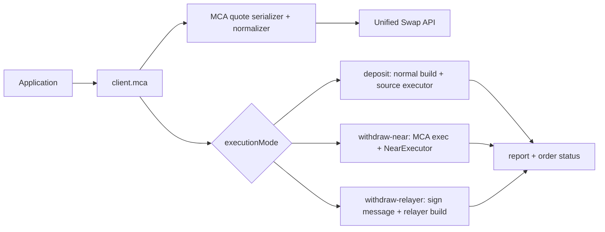

# MCA Swap 设计

- 日期：2026-07-22
- 状态：已确认
- 范围：统一 Swap 中的 MCA deposit / withdraw
- 参考：`multi-chain-lending` 的 unified swap quote、MCA withdraw preview、NEAR execution、multichain relayer、report 与 order-status 流程

## 1. 目标

在现有 `SwapClient` 上提供强类型 `client.mca` 能力，完整覆盖：

- MCA deposit，可选择 `useAsCollateral`。
- MCA withdraw，可携带 decrease collateral 和 withdraw-all 决策。
- MCA withdraw 到绑定 NEAR 钱包的直接合约执行。
- MCA withdraw 到其他链的 Intents / multichain relayer 提交。
- EVM、Solana、Bitcoin、NEAR、Aptos、Sui、Zcash、Tron 身份格式与注入式消息签名。
- 与普通 swap 一致的 quote freshness、事件、report、order status 和 history 能力。

不实现 MCA 创建、钱包绑定、资产查询、portfolio 查询、借贷、抵押率或清算业务。SDK 不持有私钥，不依赖 React、钱包 UI 或应用 Store。

## 2. 架构

公开入口为 `SwapClient.mca: McaSwapService`。MCA 服务复用 `SwapClient` 已有的 HTTP、chain executor、report 和 status 能力，但将 MCA 特殊路径隔离在 `src/mca/` 中，普通 `quote()`、`buildSwap()`、`swap()` 的行为保持兼容。



## 3. 公开 API

```ts
const quote = await client.mca.quote({
  flow: "withdraw",
  mcaAccountId: "account.near",
  fromChain: "near:mainnet",
  toChain: "eip155:1",
  tokenIn: mcaUsdc,
  tokenOut: ethereumUsdc,
  amountIn: "1000000",
  slippageBps: 50,
  sender: "account.near",
  recipient: "0x...",
  signer: {
    chain: "evm",
    identityKey: "0x...",
    signMessage: async (message) => wallet.signMessage(message),
  },
  collateral: {
    needDecrease: true,
    decreaseAmountBurrow: "1000000",
    withdrawAll: false,
  },
});

const result = await client.mca.swap({
  quote,
  signer,
  waitFor: "completed",
});
```

`McaQuote` 是可区分联合类型：

```ts
type McaQuote =
  | McaDepositQuote
  | McaWithdrawNearQuote
  | McaWithdrawRelayerQuote;
```

对应 `executionMode`：

- `deposit`
- `withdraw-near`
- `withdraw-relayer`

调用方不需要自行解析 `nearMcaWithdrawTx`、`mcaWithdrawToIntents` 或猜测 router。

## 4. Quote 请求与归一化

`McaQuoteRequest` 复用标准 `QuoteRequest`，增加：

- `flow: "deposit" | "withdraw"`
- `mcaAccountId`
- `signer` 身份及签名能力
- deposit collateral：`useAsCollateral`
- withdraw collateral：`needDecrease`、`decreaseAmountBurrow`、`withdrawAll`
- 可选 `recipientMsgSignatures`、`depositSignerProofSignatures`
- withdraw 的 `executionPreference: "auto" | "near" | "relayer"`
- auto 判定所需的 `boundNearAccountId`

序列化到后端的 `mca` 字段与参考项目保持一致：

```ts
{
  flow,
  mcaAccountId,
  signer: { chain, identityKey },
  useAsCollateral,
  needDecreaseCollateral,
  decreaseCollateralAmountBurrow,
  withdrawAll,
  recipientMsgSignatures,
  depositSignerProofSignatures
}
```

MCA token 使用调用方传入的 Burrow `tokenId` 作为 API `tokenIn` 或 `tokenOut`。SDK 不查询 lending asset metadata。

归一化规则：

- router `near-mca-deposit` 对应 `deposit`，`nearDepositTxError` 非空时 quote 失败。
- router `near-mca-withdraw` 对应 withdraw，`nearMcaWithdrawTxError` 非空时 quote 失败。
- `executionPreference: "near"` 强制 NEAR 直执行。
- `executionPreference: "relayer"` 强制 relayer。
- `auto` 仅在目标链为 NEAR、recipient 与 `boundNearAccountId` 相同且非空时选择 NEAR；其他情况选择 relayer。
- 选择的 preview 缺少必要字段时在 quote 阶段抛出 `INVALID_API_RESPONSE`。

## 5. Collateral

SDK 不读取 portfolio。调用方可直接提供后端字段，也可使用纯函数：

```ts
resolveMcaWithdrawPolicy({
  collateralBalance,
  availableBalance,
  amountIn,
  isMax,
});
```

规则与参考项目一致：

- collateral balance 大于零时设置 `needDecreaseCollateral: true`，并使用完整 collateral balance 作为 `decreaseCollateralAmountBurrow`。
- 无 collateral 时显式发送 `false` 和 `"0"`。
- `isMax` 为真、输入等于 available，或输入/available 大于等于 `0.999999` 时设置 `withdrawAll: true`。
- 所有金额均为非负十进制字符串，计算不得使用 JavaScript 浮点数。

## 6. 多链签名

```ts
interface ExecutorWalletAdapter {
  getIdentityKey?(): string | Promise<string>;
  signMessage?(
    message: string,
    options?: MessageSignOptions
  ): Promise<string>;
}
```

SDK 提供：

- `formatMcaWallet(chain, identityKey)`，输出 `{ EVM }`、`{ Solana }`、`{ Bitcoin }`、`{ Near }`、`{ Aptos }`、`{ Sui }`、`{ Zcash }`、`{ Tron }`。
- EVM identity 去掉 `0x` 前缀，与参考合约钱包格式一致。
- `selectMcaSigner(boundWallets, connectedSigners, priority?)` 只选择 identity 与 MCA 绑定值匹配且当前可用的 signer。
- 默认优先级：EVM、Solana、Bitcoin、Aptos、NEAR、Zcash、Sui、Tron。
- MCA quote 通过 `signerChain` 解析已注册 executor 的 identity。
- relayer 路径的 executor 必须具有 `signMessage`；缺失时在请求钱包前失败。
- 签名内容严格使用 API 返回的 `messageToSign`，不重新序列化 `business` 替代它。
- `beforeSign` 可用于展示 chain、identity、message 和 business 摘要。

具体钱包库由应用通过 adapter 注入。SDK 不内置私钥、JWT、access token 或浏览器全局钱包访问。

## 7. 执行路径

### 7.1 Deposit

1. MCA quote 返回 `near-mca-deposit`。
2. 使用 quote 保存的完整 build request 调用 `/api/swap/swap`。
3. 使用现有来源链 executor 授权、签名和广播。
4. report 保持普通 swap 的 `same-chain` / `cross-chain` tx type，并增加 `multi_addr: mcaAccountId`。
5. 有 orderId 时复用现有 order status。

### 7.2 Withdraw 到 NEAR

1. 从 `nearMcaWithdrawTx` 顶层、`transactions[].args` 或 FunctionCall actions 中提取 `business` 和 `signer_wallet`。
2. 将 preview 转换为标准 `NearTransaction[]`。缺少 transactions 时使用 `mcaAccountId.exec` fallback。
3. 调用现有 `NearExecutor`，由绑定 NEAR 钱包授权合约调用。参考实现该路径不要求额外 off-chain business signature。
4. report 使用 `tx_type: "mca-withdraw-near"` 和 `multi_addr`。
5. `waitFor: "completed"` 时，以 preview 的 deposit address 和 router 查询订单状态。

### 7.3 Withdraw 到 Intents / Relayer

1. 从 `mcaWithdrawToIntents` 提取 `business`、`messageToSign` 和 deposit address。
2. 格式化 signer wallet，并调用 `signMessage(messageToSign)`。
3. 构造：

```ts
{
  ...quoteBuild,
  mcaRelayer: {
    mcaAccountId,
    wallet,
    business,
    signature
  },
  mca: { ...mca, flow: "withdraw", mcaAccountId },
  deposit_address: depositAddress,
  is_cross_chain: true,
  tx_type: "mca-withdraw-relayer",
  multi_addr: mcaAccountId
}
```

4. 将该 body 提交 `/api/swap/swap`。这是 relayer 提交，不调用来源链 executor。
5. 从响应顶层或 `deposit` 中解析 orderId、router 和 deposit address。
6. report 的 `from_hash` 使用 orderId，`tx_type` 使用 `mca-withdraw-relayer`。
7. 按 orderId + router 轮询。

## 8. Report、History 与生命周期

- `SwapBuild` 增加内部 `reportContext`，允许安全覆盖 `txType`、`multiAddr`、deposit address、sender、recipient 和 cross-chain 标记。
- 普通 swap 不提供 `reportContext` 时行为完全不变。
- report 失败仍返回已提交结果，并通过 `REPORT_FAILED` warning 告知调用方。
- `client.mca.getHistory({ mcaAccountId })` 使用 MCA account id 作为 history API 的 `sender` 搜索值；后端匹配 `sender`、`recipient` 或 `multi_addr`。SDK 不再按 raw `multi_addr` 二次过滤，避免被展示值 `Cross-chain Account` 误伤。
- MCA 编排复用现有生命周期事件；relayer 路径至少发出 `signing-requested`、`submitted`、`order-status`、`completed` 或 `failed`。
- 同一个 quote/build 的并发重复执行继续受 executionId 防重保护；build 和 relayer submit 仅在调用方显式提供 idempotency key 时发送该 header。

## 9. 错误与安全

- MCA account、identity、recipient、business、message、deposit address、router 和 orderId 均在使用前验证。
- 不修改 API 返回的原始对象；签名和 build body 使用深拷贝后的对象。
- 日志不得包含签名、message、business、完整交易或 access token。
- 用户拒签映射为 `USER_REJECTED`，签名能力缺失或签名失败映射为 `SIGNING_FAILED`。
- preview 结构不合法映射为 `INVALID_API_RESPONSE`，不支持的执行模式映射为 `INVALID_REQUEST`。
- report 失败不掩盖已发生的链上或 relayer 提交。

## 10. 验收标准

- MCA deposit 可通过任一现有来源链 executor 完成，并正确携带 collateral 与 `multi_addr`。
- withdraw-to-NEAR 能解析三种 preview business 位置、构造标准 NEAR transaction 并执行。
- withdraw-to-relayer 只签 API message，提交精确的 `mcaRelayer` body，并能 report 和轮询。
- 九种 MCA identity 能格式化，connected signer 只在绑定 identity 匹配时被选择。
- collateral helper 覆盖无抵押、有抵押、max、相等和 0.999999 阈值。
- MCA history 可以按 `multi_addr` 过滤。
- 原有普通 swap 的测试、类型检查、lint、CJS/ESM 构建全部保持通过。
